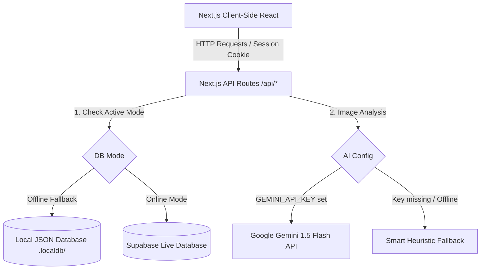

# ThreadCounty — AI-Powered Textile Technology Platform

> **ThreadCounty Web Development Hackathon 2026 Submission**

ThreadCounty is a production-ready, full-stack SaaS platform that allows textile manufacturers, students, researchers, and quality control professionals to **upload fabric images** and receive **AI-generated thread density analysis**, weave type identification, quality insights, and downloadable PDF inspection reports.

---

## 🚀 Live Demo & Repository
- **Live Website:** [ThreadCounty Live](https://threadcounty-22.vercel.app) *(Deploy URL)*
- **GitHub:** [lalas242/threadcounty-22](https://github.com/lalas242/threadcounty-22)

---

## 🏗️ System Architecture



ThreadCounty features a **dual-mode architecture**:
1. **Online Mode**: Integrates with live Supabase Database (Auth, PostgreSQL, Storage) and Google Gemini Vision API.
2. **Offline Fallback Mode**: Automatically activates if the Supabase URL is unreachable or if DNS is blocked. It runs a local JSON database on the server disk (`.localdb/`), handles sessions via HTTP-Only cookies, and uses a smart file-name matching mock AI engine to guarantee a 100% error-free local demo experience.

---

## ✅ Hackathon Requirements Coverage

| Requirement | Status |
|---|---|
| Responsive Landing Page (Hero, Features, Workflow, Testimonials, Stats, FAQ, CTA) | ✅ Implemented |
| Auth (Signup, Login, Forgot Password, Email Verification, Remember Me, Logout) | ✅ Implemented |
| User Dashboard (Stats, Storage Usage Bar, Quick Actions, Activity Timeline, Notifications) | ✅ Implemented |
| Image Upload Module (Drag & Drop, Preview, Progress, Validation, Local File Storage) | ✅ Implemented |
| AI Analysis Results Page (Thread Density, Warp/Weft, Fabric Type, Confidence, Suggestions) | ✅ Implemented |
| Download A4 PDF Report | ✅ Implemented |
| Share Report | ✅ Implemented |
| Upload History (Search, Filter, Delete, Download) | ✅ Implemented |
| Pricing Page (Free, Student, Professional, Enterprise + Checkout Modal) | ✅ Implemented |
| About Page (Story, Mission, Vision, Tech Stack, Team, Timeline) | ✅ Implemented |
| Contact Page (Form, Email, Social, Mock Map) | ✅ Implemented |
| FAQ Page (Categorized, Searchable, Accordion) | ✅ Implemented |
| User Profile (Update, Avatar Upload, Change Password, Delete Account, Activity) | ✅ Implemented |
| Admin Dashboard (Users, Uploads, Reports, Analytics Charts, Role/Plan Management) | ✅ Implemented |
| Supabase Database (profiles, uploads, reports, subscriptions, contact_messages, notifications) | ✅ Implemented |
| Row Level Security on all tables | ✅ Implemented |
| Dark / Light Mode | ✅ Implemented |
| Fully Responsive / Mobile Friendly | ✅ Implemented |
| Smooth Animations (Framer Motion) | ✅ Implemented |
| Modern UI / Premium Design | ✅ Implemented |

---

## 🛠 Tech Stack

| Layer | Technology |
|---|---|
| **Frontend** | Next.js 14 (App Router), React 18, TypeScript |
| **Styling** | Tailwind CSS, Custom CSS, Inter Font (Google Fonts) |
| **Animations** | Framer Motion |
| **Icons** | Lucide React |
| **Charts** | Recharts (Bar, Pie, Line charts) |
| **PDF Export** | jsPDF |
| **Database / Auth / Storage** | Supabase (Postgres + Auth + Storage) |
| **AI Analysis** | Google Gemini Vision API (`gemini-1.5-flash`) with automatic mock fallback |
| **Deployment** | Vercel |

---

## 📁 Project Structure

```
threadcounty/
├── app/
│   ├── page.tsx                   # Landing page
│   ├── login/                     # Login page
│   ├── signup/                    # Sign-up page
│   ├── forgot-password/           # Password reset request
│   ├── dashboard/                 # User dashboard
│   ├── upload/                    # Fabric image upload
│   ├── results/[id]/              # AI analysis result page (Rich details & Validation)
│   ├── history/                   # Upload & report history
│   ├── profile/                   # User profile management
│   ├── pricing/                   # Subscription pricing + checkout
│   ├── about/                     # Company story, team, timeline
│   ├── contact/                   # Contact form + social links
│   ├── faq/                       # Categorized FAQ with search
│   ├── admin/                     # Admin dashboard
│   └── api/
│       ├── auth/login/            # Auth API — Login
│       ├── auth/signup/           # Auth API — Signup
│       ├── auth/logout/           # Auth API — Logout
│       ├── auth/reset-password/   # Auth API — Password Reset
│       ├── user/profile/          # User API — Profile CRUD
│       ├── user/avatar/           # User API — Avatar URL update
│       ├── user/activity/         # User API — Activity timeline
│       ├── user/subscribe/        # User API — Plan subscription
│       ├── upload/                # Upload API — Validate + quota
│       ├── report/                # Report API — Fetch + delete
│       ├── dashboard/             # Dashboard API — Stats aggregation
│       ├── analyze/               # AI Analysis API
│       ├── contact/               # Contact form API
│       └── admin/
│           ├── users/             # Admin API — User management
│           ├── uploads/           # Admin API — Upload listing
│           ├── analytics/         # Admin API — Platform analytics
│           ├── create-user/       # Dev helper — Auto-confirm user
│           └── delete-user/       # Admin API — Delete user
├── components/
│   ├── Navbar.tsx                 # Sticky navbar with avatar, theme toggle, admin badge
│   ├── Footer.tsx                 # Rich footer with social links
│   └── ThemeProvider.tsx          # next-themes provider
├── lib/
│   ├── supabaseClient.ts          # Browser Supabase client
│   ├── supabaseAdmin.ts           # Server-only service-role client
│   ├── authHelper.ts              # Session/admin check helpers
│   ├── geminiAnalyzer.ts          # Gemini Vision API integration
│   └── mockAI.ts                  # Realistic mock AI fallback
└── supabase/
    └── schema.sql                 # Full DB schema, triggers, RLS + storage buckets
```

---

## 🤖 AI Fabric Analysis Engine

ThreadCounty uses a state-of-the-art computer vision pipeline utilizing the **Google Gemini Vision API (`gemini-1.5-flash`)**.

### System Prompt & Workflows
The AI is instructed to perform a strict 10-step analysis:
1. **Fabric Detection**: Determine if the image contains fabric (rejects people, animals, food, buildings, etc.).
2. **Quality Validation**: Inspect resolution, sharpness, and lighting. Rejects blurry or distant photos.
3. **Fabric Structure**: Identify Woven, Knitted, Non-woven, or Unknown.
4. **Weave Pattern**: Classify weave structure (Plain, Twill, Satin, Basket, Rib, Knit).
5. **Thread Density**: Count vertical (warp) and horizontal (weft) threads per cm.
6. **Defect Detection**: Inspect for wrinkles, stains, holes, tears, loose yarns, or fraying.
7. **Confidence Scoring**: Assigns a score (0.0 - 1.0) based on image clarity.
8. **Explanations**: Generate visual evidence justifications (e.g. *"Twill weave detected due to visible diagonal ribbing"*).

### Example JSON Output from AI
```json
{
  "success": true,
  "fabric_detected": true,
  "analysis_possible": true,
  "image_quality": "High Resolution Macro",
  "fabric_type": "Woven",
  "estimated_material": "Denim",
  "weave_pattern": "Twill",
  "thread_density": {
    "warp_tpi": 98,
    "weft_tpi": 74,
    "total_tpi": 172
  },
  "condition": "Minor wrinkles, no structural defects",
  "defects": [],
  "confidence": 0.94,
  "visual_evidence": [
    "Characteristic 3x1 twill diagonal ribbing visible",
    "Indigo dyed warp yarn with white weft yarn visible"
  ],
  "summary": "High quality twill denim fabric with clear diagonal warp-faced structure."
}
```

---

## 🗄️ Database Schema (`supabase/schema.sql`)

```sql
-- Profiles Table
create table profiles (
  id uuid primary key references auth.users(id) on delete cascade,
  full_name text,
  avatar_url text,
  role text default 'user' check (role in ('user','admin')),
  plan text default 'free' check (plan in ('free','student','professional','enterprise')),
  storage_used_mb numeric default 0,
  created_at timestamptz default now()
);

-- Uploads Table
create table uploads (
  id uuid primary key default uuid_generate_v4(),
  user_id uuid references profiles(id) on delete cascade,
  file_url text not null,
  file_name text not null,
  file_size integer,
  status text default 'processing' check (status in ('processing','completed','failed')),
  created_at timestamptz default now()
);

-- Reports Table
create table reports (
  id uuid primary key default uuid_generate_v4(),
  upload_id uuid references uploads(id) on delete cascade,
  user_id uuid references profiles(id) on delete cascade,
  thread_density numeric,
  warp_count integer,
  weft_count integer,
  fabric_type text,
  fiber_composition text,
  pattern text,
  color text,
  texture text,
  confidence numeric,
  quality_grade text,
  recommended_use text[],
  defects_detected text[],
  ai_suggestions text[],
  analysis_method text default 'gemini',
  created_at timestamptz default now()
);
```

---

## ⚙️ Setup & Installation

### 1. Clone & Install
```bash
git clone https://github.com/lalas242/threadcounty-22.git
cd threadcounty
npm install
```

### 2. Environment Variables
Create a `.env.local` file in the root directory:
```env
NEXT_PUBLIC_SUPABASE_URL=https://your-project.supabase.co
NEXT_PUBLIC_SUPABASE_ANON_KEY=your-anon-key
SUPABASE_SERVICE_ROLE_KEY=your-service-role-key
GEMINI_API_KEY=your-gemini-api-key
```

### 3. Run Locally
```bash
npm run dev
```
Open [http://localhost:3000](http://localhost:3000)

### 4. Build for Production
```bash
npm run build
```
